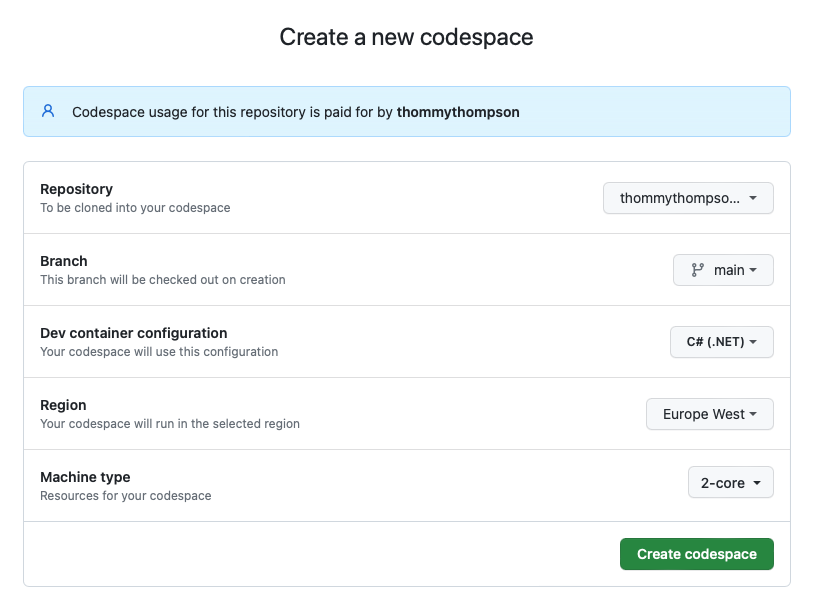

# han-asd-adp-project

This project is an exam excercise for the HAN ASD course that part of the HBO-ICT degree. The project contains Abstract Data Type (ADT) & Algoritm implementations.

## Structure

The whole solution is written in C#, and contains 4 projects in total:

* ADPProject.Library: This projects contains the ADT/algoritm implementations.
* ADPProject.UnitTests: This projects tests wheter the ADT's/algoritms actually function as they should.
* ADPProject.PerformanceTests: This projects tests the peformance of all ADT methods and algoritm by executing the opertation x amount of time and measuring the time taken.
* ADPProject.DataTests: This projects tests wheter the ADT/Algoritm implementation actually can read the datasets provided by the HAN.

## Running the code

To run the code without having to setup a local dev environment you could use the GitHub codespace feature (VS Code web using a cloud hosted dev container) or use VS Code's dev container feature locally. To create a dev container that contains all the required VS Code extensions you can use the `devcontainer.json` file that's available in the `.devcontainer` folder within this repository.

### The C# Dev Kit

To make use of the test explorer within VS Code the C# Dev Kit extension is used, this extension sadly requires you to login using a microsoft account.


### Running the tests

In the side bar there is a icon for "Testing", if you click on this icon you will see that there currenlty are no tests available.


This is because the solution is not build yet, to build the solution enter the commands below in the terminal.

```bash
dotnet build ./src/ADPProject/
```

It might take a while but eventually the tests will show up in the test explorer and you will be able to run them.


### GitHub Codespace

To setup a code space navigate to [https://github.com/codespaces](https://github.com/codespaces) and click on "New code space", next select the settings as shown below.



Click on "Create codespace", the codespace now will be build a new tab with VS Code for web will be opened, wait untill all the extensions are installed.

### Local devcontainer

Make sure to have docker desktop installed and running.

Install the "Dev Containers" extension within VS Code.


Open the command pallet and use the "> Dev Containers: Reopen in Container" command to connect to a devcontainer.


Wait a while, it will build and start the dev container and reopen a new VS Code windows that is connected to the devcontainer.


## Links

[Grading](./docs/ADPProjectRubrics.xlsx)

[About Datasets](./docs/Datasets.md)

[Sources used for research](./docs/Sources.md)
